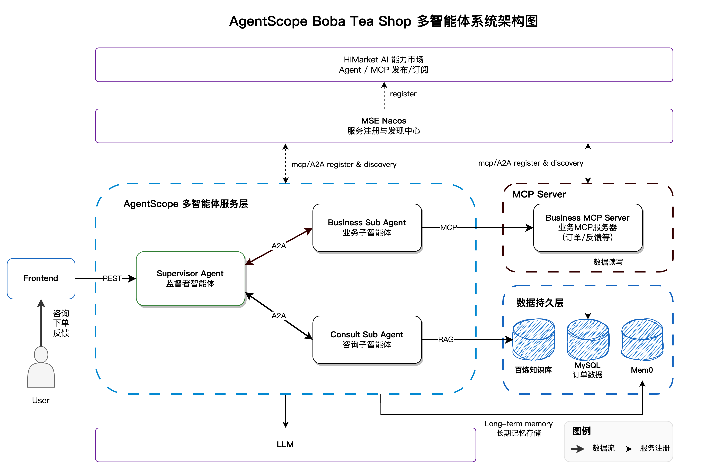

# 🧋 AgentScope Boba Tea Shop

<p align="center">
  <strong>基于 AgentScope Java 框架构建的多智能体奶茶店演示系统</strong>
</p>

<p align="center">
  <a href="#项目简介">项目简介</a> •
  <a href="#功能特性">功能特性</a> •
  <a href="#系统架构">系统架构</a> •
  <a href="#技术栈">技术栈</a> •
  <a href="#核心组件">核心组件</a> •
  <a href="#快速开始">快速开始</a> •
  <a href="#协议说明">协议说明</a>
</p>

---

## 📖 项目简介

Boba Tea Shop 是一个基于 **AgentScope Java** 框架构建的多智能体系统示例，模拟了一个智能奶茶店的完整业务场景。该系统展示了如何使用 AgentScope 框架实现多个智能体之间的协作，包括任务分发、业务处理、知识检索等核心能力。

通过这个示例，您可以学习到：

- 🤖 **多智能体协作模式**：Supervisor Agent 如何协调多个子 Agent 完成复杂任务
- 🔗 **A2A 协议**：Agent-to-Agent 通信协议的实现与应用
- 🛠️ **MCP 协议**：Model Context Protocol 工具调用的实践
- 📚 **RAG 知识检索**：基于百炼知识库的智能问答
- 💾 **会话管理**：支持 MySQL 持久化的会话状态管理
- 🧠 **智能记忆**：自动压缩的短期记忆以及基于 Mem0 的长期记忆
- ☁️ **云原生部署**：支持 Docker、Kubernetes 等多种部署方式

---

## ✨ 功能特性

### 业务功能

| 功能 | 描述 |
|------|------|
| 🛒 **智能下单** | 支持自然语言下单，自动识别产品、甜度、冰量等偏好 |
| 📋 **订单查询** | 查询历史订单、订单详情、多维度筛选 |
| 💬 **产品咨询** | 基于 RAG 知识库的产品信息、店铺介绍咨询 |
| 📝 **用户反馈** | 接收并处理用户投诉、建议和评价 |
| 📊 **经营报告** | 自动生成门店经营分析报告（可选） |
| ⏰ **定时任务** | 支持 XXL-JOB 定时触发 Agent 任务（可选） |

### 技术特性

| 特性 | 描述 |
|------|------|
| 🔄 **流式响应** | 支持 SSE 流式输出，实时展示 Agent 思考过程 |
| 🧠 **上下文压缩** | AutoContextMemory 自动压缩对话上下文 |
| 💾 **会话持久化** | 基于 MySQL 的会话状态存储与恢复 |
| 🔍 **服务发现** | 基于 Nacos 的服务注册与发现 |
| 📡 **协议支持** | 同时支持 A2A 和 MCP 两种智能体通信协议 |

---

## 🏗️ 系统架构



---

## 🛠️ 技术栈

### 后端技术栈

| 技术 | 说明            |
|------|---------------|
| **AgentScope Java** | 多智能体框架核心      |
| **Spring Boot** | 应用框架          |
| **MCP Spring Webflux** | MCP Server 构建 |
| **MySQL** | 关系型数据库        |
| **Nacos** | 服务注册与配置中心     |

### 前端技术栈

| 技术 | 说明 |
|------|------|
| **Vue 3** | 前端框架 |
| **TypeScript** | 类型安全 |
| **Vue Router** | 路由管理 |
| **Pinia** | 状态管理 |

### AI 服务

| 服务 | 说明 |
|------|------|
| **DashScope** | 阿里云大模型服务（qwen-max 等） |
| **Bailian RAG** | 阿里云百炼知识库检索服务 |
| **Mem0** | 用户记忆管理服务 |
| **OpenAI** | 可选，支持 OpenAI 兼容接口 |

### AgentScope 扩展

| 扩展 | 说明 |
|------|------|
| `agentscope-core` | 核心框架，包含 ReActAgent 等 |
| `agentscope-extensions-nacos-a2a` | A2A 协议 Nacos 服务发现 |
| `agentscope-extensions-mcp-nacos` | MCP 协议 Nacos 服务发现 |
| `agentscope-extensions-mem0` | Mem0 记忆服务集成 |
| `agentscope-extensions-session-mysql` | MySQL 会话持久化 |
| `agentscope-extensions-autocontext-memory` | 自动上下文压缩 |
| `agentscope-extensions-scheduler-xxl-job` | XXL-JOB 定时任务（可选） |

---

## 📦 核心组件

### 1. Supervisor Agent（监督者智能体）

**职责**：作为系统的入口和协调者，负责接收用户请求并分发给合适的子智能体处理。

**核心实现**：

```java
// 基于 ReActAgent 实现的监督者智能体
ReActAgent agent = ReActAgent.builder()
    .name("supervisor_agent")
    .sysPrompt(sysPrompt)
    .toolkit(toolkit)      // 包含 A2A 调用工具
    .model(model)          // LLM 模型
    .memory(memory)        // AutoContextMemory
    .build();
```

**关键特性**：
- 使用 `AutoContextMemory` 自动压缩上下文，优化 Token 使用
- 通过 `A2aAgentTools` 调用子智能体
- 支持 MySQL 会话持久化

### 2. Business Sub Agent（业务子智能体）

**职责**：处理订单创建、查询、修改等业务操作，以及用户投诉和反馈。

**核心实现**：
- 作为 A2A Server 注册到 Nacos
- 通过 MCP 协议调用 Business MCP Server

### 3. Consult Sub Agent（咨询子智能体）

**职责**：处理产品咨询、店铺信息查询等咨询类请求。

**核心实现**：
- 集成百炼 RAG 知识库检索
- 提供产品信息查询、搜索等工具

### 4. Business MCP Server（业务 MCP 服务器）

**职责**：提供订单、库存、反馈等业务能力的 MCP 工具接口。

**提供的 MCP 工具**：

| 工具名 | 功能 |
|--------|------|
| `order-create-order-with-user` | 创建订单 |
| `order-get-order` | 查询订单 |
| `order-get-orders-by-user` | 查询用户订单列表 |
| `order-query-orders` | 多维度订单查询 |
| `order-check-stock` | 检查库存 |
| `order-delete-order` | 删除订单 |
| `feedback-*` | 反馈相关操作 |

### 5. Frontend（前端界面）

**职责**：提供用户交互界面，支持与 Agent 对话。

**核心页面**：
- **Chat**：对话界面，支持流式输出和 Markdown 渲染
- **Settings**：配置后端地址和用户 ID
- **Reports**：查看经营报告（可选功能）

---

## 🔌 协议说明

### A2A (Agent-to-Agent) 协议

A2A 协议用于智能体之间的通信，Supervisor Agent 通过 A2A 协议调用子智能体。

**服务发现**：基于 Nacos 实现，子智能体启动时自动注册，Supervisor Agent 通过服务名发现并调用。

### MCP (Model Context Protocol) 协议

MCP 协议用于智能体调用外部工具服务，Business Sub Agent 通过 MCP 调用 Business MCP Server。

**MCP Server 注册**：

```yaml
agentscope:
  mcp:
    nacos:
      server-addr: ${NACOS_SERVER_ADDR:127.0.0.1:8848}
      namespace: ${NACOS_NAMESPACE:public}
```

---

## 🚀 快速开始

### 变量介绍

以下表格汇总了本地部署、Docker 部署和 Kubernetes 部署中使用的配置变量对照关系。

#### 模型配置（必需）

| 说明 | 本地/Docker 环境变量 | K8S values.yaml 参数 | 默认值 |
|------|---------------------|---------------------|--------|
| 模型提供商 | `MODEL_PROVIDER` | `agentscope.model.provider` | `dashscope` |
| 模型 API Key | `MODEL_API_KEY` | `agentscope.model.apiKey` | - |
| 模型名称 | `MODEL_NAME` | `agentscope.model.modelName` | `qwen-max` |
| OpenAI 接口地址 | `MODEL_BASE_URL` | `agentscope.model.baseUrl` | - |

#### 百炼知识库配置（必需）

| 说明 | 本地/Docker 环境变量 | K8S values.yaml 参数 | 默认值 |
|------|---------------------|---------------------|--------|
| 阿里云 Access Key ID | `DASHSCOPE_ACCESS_KEY_ID` | `dashscope.accessKeyId` | - |
| 阿里云 Access Key Secret | `DASHSCOPE_ACCESS_KEY_SECRET` | `dashscope.accessKeySecret` | - |
| 百炼工作空间 ID | `DASHSCOPE_WORKSPACE_ID` | `dashscope.workspaceId` | - |
| 知识库索引 ID | `DASHSCOPE_INDEX_ID` | `dashscope.indexId` | - |

> 💡 **提示**：RAG 知识库索引可以使用 `consult-sub-agent/src/main/resources/knowledge` 目录下的文件构建。

#### Mem0 记忆服务配置（必需）

| 说明 | 本地/Docker 环境变量 | K8S values.yaml 参数 | 默认值 |
|------|---------------------|---------------------|--------|
| Mem0 API Key | `MEM0_API_KEY` | `mem0.apiKey` | - |

#### MySQL 数据库配置（必需）

| 说明 | 本地/Docker 环境变量 | K8S values.yaml 参数 | 默认值 |
|------|---------------------|---------------------|--------|
| 是否部署内置 MySQL | - | `mysql.deployEnabled` | `true` |
| 主机地址 | `DB_HOST` | `mysql.host` | `localhost` / `mysql` |
| 端口 | `DB_PORT` / `MYSQL_PORT` | - | `3306` |
| 数据库名 | `DB_NAME` | `mysql.dbname` | `multi_agent_demo` |
| 用户名 | `DB_USERNAME` | `mysql.username` | `multi_agent_demo` |
| 密码 | `DB_PASSWORD` | `mysql.password` | `multi_agent_demo@321` |

#### Nacos 服务配置（必需）

| 说明 | 本地/Docker 环境变量 | K8S values.yaml 参数 | 默认值 |
|------|---------------------|---------------------|--------|
| 是否部署内置 Nacos | - | `nacos.deployEnabled` | `true` |
| 服务地址 | `NACOS_SERVER_ADDR` | `nacos.serverAddr` | `localhost:8848` / `nacos-server:8848` |
| 命名空间 | `NACOS_NAMESPACE` | `nacos.namespace` | `public` |
| 是否启用服务注册 | `NACOS_REGISTER_ENABLED` | `nacos.registerEnabled` | `true` |

#### 镜像配置（Docker/K8S）

| 说明 | Docker 环境变量 | K8S values.yaml 参数 | 默认值 |
|------|----------------|---------------------|--------|
| 镜像仓库地址 | `IMAGE_REGISTRY` | `image.registry` | `registry.cn-hangzhou.aliyuncs.com/agentscope` |
| 镜像标签 | `IMAGE_TAG` | `image.tag` | `1.0.1` |
| 镜像拉取策略 | - | `image.pullPolicy` | `Always` |

### 一键部署

#### 方式一：本地部署（推荐）

适用于开发调试，需要本地安装 JDK 17+、Node.js 18+、Maven 3.6+。

```bash
# 1. 配置环境变量
cp local-env.example local-env.sh
vim local-env.sh  # 填写环境变量

# 2. 加载环境变量并启动
source local-env.sh
./local-deploy.sh start
```

#### 方式二：Kubernetes 部署（推荐）

适用于生产环境，支持 Helm 一键部署。

```bash
# 1. 修改 values.yaml 文件
# 2. 创建命名空间
kubectl create namespace agentscope

# 3. 部署
helm install agentscope helm/ \
  --namespace agentscope \
  --values helm/values.yaml
```

#### 方式三：Docker 部署

适用于快速体验，仅需安装 Docker 和 Docker Compose。

```bash
# 1. 配置环境变量
cp docker-env.example .env
vim .env  # 填入 API Keys

# 2. 启动所有服务
docker-compose up -d
``` 

#### HiMarket
HiMarket 的介绍以及构建部署指南详见 [HIMARKET_DEPLOYMENT.md](HIMARKET_DEPLOYMENT_zh.md)

### 功能验证

1. 访问前端页面
2. 点击右上角 **设置** 图标
3. 配置后端访问地址与用户ID并保存
4. 与 Agent 对话

### 镜像构建

如需自行构建镜像：

👉 **详细指南**：[IMAGE_BUILD_GUIDE.md](IMAGE_BUILD_GUIDE_zh.md)

```bash
# 构建所有模块
./build.sh -m all -v 1.0.0 -p linux/amd64 -r your-registry --push
```

## 📂 项目结构

```
boba-tea-shop/
├── supervisor-agent/          # 监督者智能体
│   ├── src/main/java/         # Java 源码
│   │   └── agent/             # Agent 实现
│   │   └── config/            # 配置类
│   │   └── controller/        # REST 控制器
│   │   └── tools/             # A2A 工具
│   └── src/main/resources/    # 配置文件
│
├── business-sub-agent/        # 业务子智能体
│   └── src/main/java/
│       └── config/            # A2A Server 配置
│
├── consult-sub-agent/         # 咨询子智能体
│   ├── src/main/java/
│   │   └── service/           # 知识库检索服务
│   │   └── tools/             # 咨询工具
│   └── src/main/resources/
│       └── knowledge/         # 知识库文档
│
├── business-mcp-server/       # 业务 MCP 服务器
│   └── src/main/java/
│       └── OrderMcpTools.java # 订单 MCP 工具
│       └── FeedbackMcpTools.java
│
├── frontend/                  # Vue 前端
│   └── src/
│       └── components/        # 组件
│       └── views/             # 页面
│       └── stores/            # 状态管理
│
├── helm/                      # Kubernetes Helm Charts
├── mysql-image/               # MySQL Docker 镜像
├── nacos-image/               # Nacos Docker 镜像
│
├── docker-compose.yml         # Docker Compose 配置
├── build.sh                   # 构建脚本
├── local-deploy.sh            # 本地部署脚本
└── pom.xml                    # Maven 父 POM
```

---

## 📄 许可证

本项目采用 Apache License 2.0许可证。

---

<p align="center">
  <sub>Built with ❤️ by AgentScope Team</sub>
</p>
